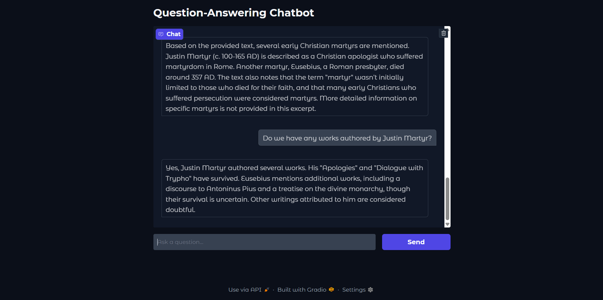
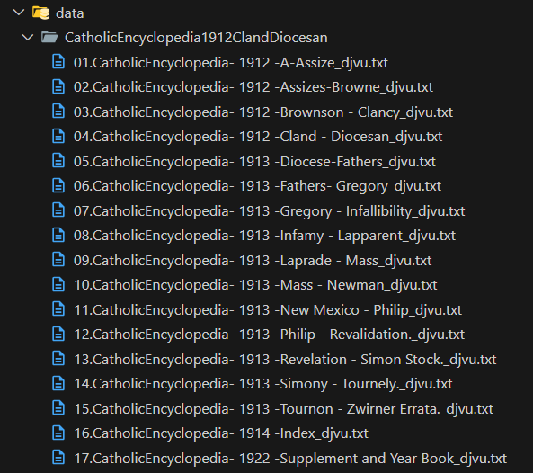
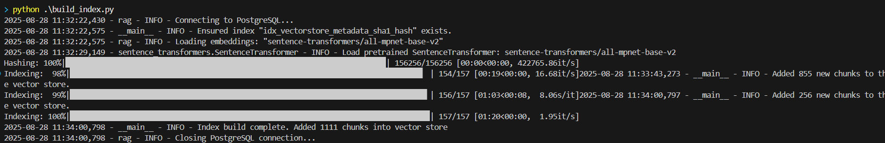

<!-- markdownlint-disable md033 md041 -->

# DocuChat: Modular RAG System with LangChain and PGVector

**DocuChat** provides a complete, ready-to-use Retrieval-Augmented Generation (RAG) system for building a question-answering chatbot over your own documents. It features a clean, asynchronous Python architecture, a choice of a command-line or web interface, and an efficient data ingestion pipeline.

It is built with a modern, production-ready stack, making it a solid foundation for more complex AI applications.

<p align="center">
  <a href="https://www.python.org/downloads/release/python-3120/" target="_blank"></a>
  <a href="https://www.langchain.com/" target="_blank"></a>
  <a href="https://www.postgresql.org/" target="_blank"></a>
  <a href="https://www.docker.com/" target="_blank"></a>
  <a href="https://pytorch.org/" target="_blank"></a>
  <a href="https://huggingface.co/sentence-transformers" target="_blank"></a>
  <a href="https://www.gradio.app/" target="_blank"></a>
</p>

<p align="center">
  
</p>

## Features

- **RAG Pipeline**: Implements a robust Retrieve-then-Generate pipeline using `LangChain` and `LangGraph` for state management.
- **Pluggable LLMs**: Easily configurable to use different Large Language Models. It is pre-configured for Google's Gemini family.
- **High-Quality Embeddings**: Utilizes Hugging Face `sentence-transformers` for generating document embeddings, with automatic device detection (CUDA/CPU).
- **Persistent Vector Storage**: Leverages PostgreSQL with the `pgvector` extension for scalable and persistent vector storage, managed via `SQLAlchemy` and `LangChain`'s integrations.
- **Efficient Data Ingestion**: An idempotent script processes and indexes your documents, using content hashing (SHA1) to prevent re-indexing duplicates, saving time and compute.
- **Dual Interfaces**:
  - An interactive Command-Line Interface (CLI) for quick tests and local use.
  - A user-friendly web interface built with `Gradio`.
- **Containerized Database**: Comes with a `docker-compose` setup for spinning up the PostgreSQL/pgvector database in a single command.
- **Modern Python Stack**: Built with Python 3.12, `asyncio` for concurrent operations, and `Pydantic` for robust, type-safe configuration management.

## Tech Stack

- **Orchestration**: LangChain, LangGraph
- **LLM**: Google Gemini (via `langchain-google-genai`)
- **Embeddings**: Hugging Face Sentence Transformers
- **Vector Database**: PostgreSQL + pgvector
- **Web UI**: Gradio
- **Infrastructure**: Docker
- **Configuration**: Pydantic

## Getting Started

Follow these steps to get the RAG system running on your local machine.

### Prerequisites

- Git
- Docker and Docker Compose
- Python 3.12+

### 1. Clone the Repository

```bash
git clone https://github.com/hnthap/docu-chat.git
cd docu-chat
```

### 2. Configure Environment Variables

The project uses `.env` files for configuration. You'll need to create two.

First, create a file for the database credentials at `pgvector/.env`:

```ini
# pgvector/.env
POSTGRES_USER=langchain
POSTGRES_PASSWORD=langchain
POSTGRES_DB=langchain
```

Next, create the main configuration file `.env` in the project root. This is where you'll add your API key.

```ini
# .env
GOOGLE_API_KEY="your-google-gemini-api-key"

# These should match the values in pgvector/.env
POSTGRES_HOST=localhost
POSTGRES_PORT=6024

# Vector store settings
TABLE_NAME=vectorstore
VECTOR_SIZE=768 # Corresponds to the default embedding model 'all-mpnet-base-v2'
```

### 3. Install Dependencies

It is highly recommended to use a virtual environment:

```bash
python -m venv venv
source venv/bin/activate  # On Windows, use `venv\Scripts\activate`
```

You can also use `conda`. Using a virtual environment would help to preserve producibility and prevent confliction with existing packages.

**⚠️⚠️⚠️ Important**: Install PyTorch v2.7.1 first, following the official instructions for your system (CPU or CUDA). See [PyTorch Previous Versions](https://pytorch.org/get-started/previous-versions/). **Always make sure that PyTorch is installed before anything else!**

Then, install the rest of the project dependencies:

```bash
pip install -r requirements.txt
```

### 4. Start the Database

Run the following command from the project root to start the PostgreSQL database in a Docker container.

```bash
docker-compose up -d
```

The database will be available on `localhost:6024`.

## Usage

### Step 1: Add Your Documents

Place your text files (`.txt`) inside the `data/` directory (you may need to create it). The ingestion script will find them recursively.

```text
├── data/
│   ├── project_a_report.txt
│   └── financials/
│       └── q4_earnings.txt
└── ...
```

Notes that you can use this with financial reports, encyclopedias, project descriptions, or any other textual contents. There is no limitations, but you need to fulfill your obligations relating to copyright, etc. Here is an example where I use the Catholic Encyclopedia (1912):

<p align="center">
  
</p>

### Step 2: Ingest and Index the Data

Run the ingestion script. This will read your documents, split them into chunks, generate embeddings, and store them in the vector database.

```bash
python build_index.py
```

You will see progress bars as the documents are processed. Thanks to content hashing, you can run this script multiple times, and it will only add new, unseen document chunks.

<p align="center">
  
</p>

### Step 3: Run the Application

You can interact with the RAG system via the CLI or the web UI.

#### Option A: Interactive CLI

To start the command-line interface:

```bash
python rag.py
```

You can then start asking questions. Type `\exit` to quit.

#### Option B: Gradio Web UI

To launch the web application:

```bash
python rag.py serve
```

Open your browser and navigate to the local URL provided (usually `http://127.0.0.1:7860`).

## Project Structure

A brief overview of the key files in this project:

```text
.
├── config.py           # Pydantic-based settings management.
├── docker-compose.yml  # Docker configuration for the pgvector database.
├── helper.py           # Utility functions for logging and I/O.
├── build_index.py      # Script for processing and indexing documents.
├── rag.py              # Main application logic, including the RAG class, LangGraph definition, and interfaces (CLI, Gradio).
├── requirements.txt    # Python package dependencies.
└── data/               # (Create this) Directory for your source documents.
```

## Roadmap & Future Improvements

This project is a strong foundation, and here are some potential next steps:

- **Testing**: Implement a full test suite with `pytest` (unit and integration tests) to ensure reliability.
- **Observability**: Integrate structured logging (e.g., JSON logs) and add observability hooks for monitoring in production.
- **Error Handling**: Introduce more specific exception classes and retry mechanisms (e.g., with `tenacity`) for network-dependent operations.
- **CI/CD**: Set up a GitHub Actions workflow for automated testing, linting, and building.
- **Containerize Application**: Dockerize the main Python application for consistent deployments.
- **Session Management**: Implement session-scoped conversation history for a multi-user web deployment.
